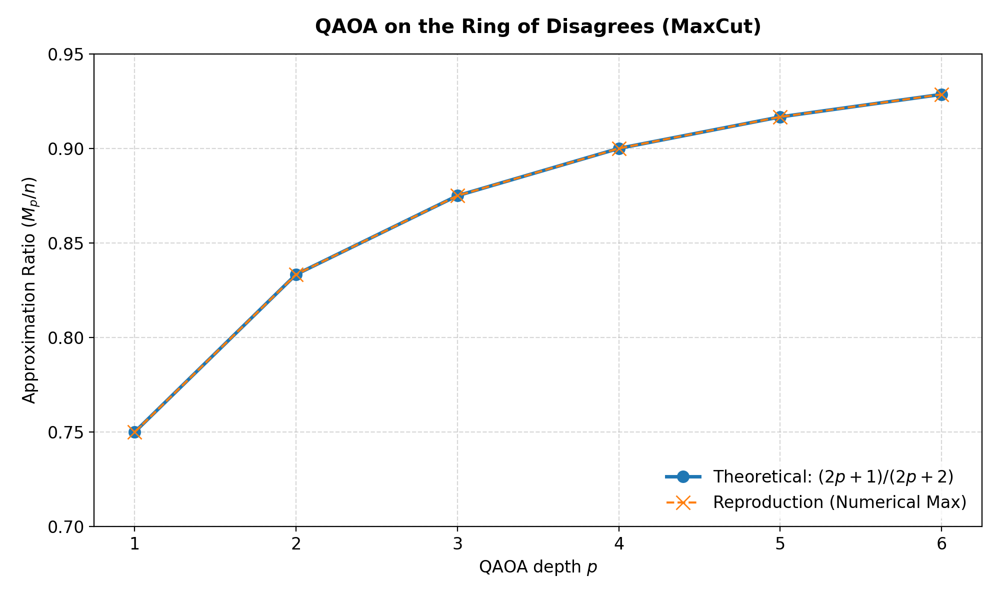
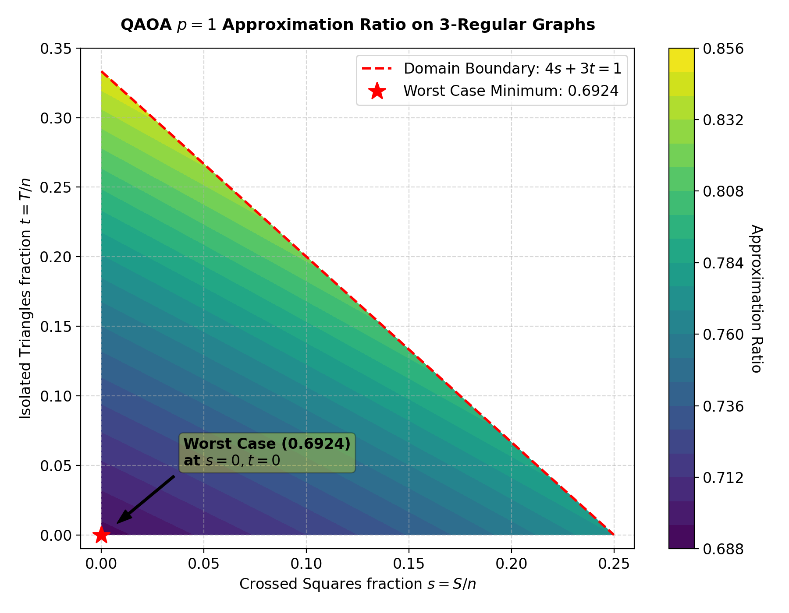
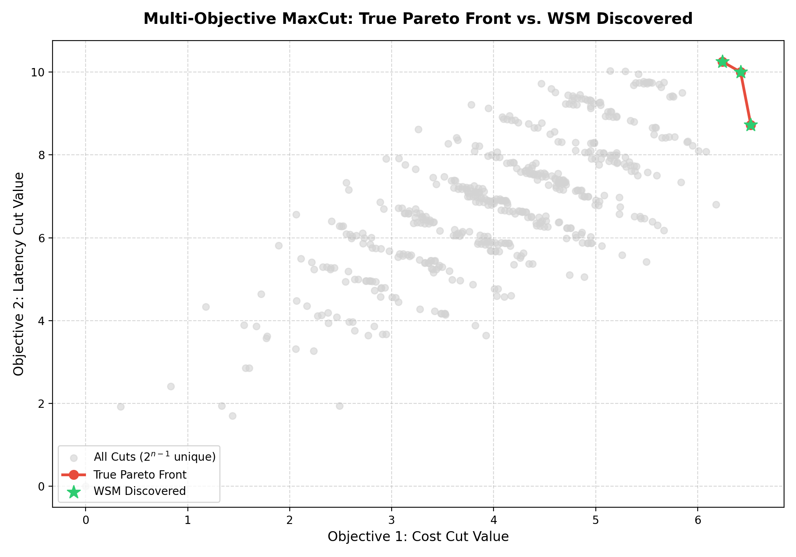

# Conclusion Report: QAOA Replication

This report concludes the recreation of the foundational quantum computing paper:
**"A Quantum Approximate Optimization Algorithm"** (Edward Farhi, Jeffrey Goldstone, and Sam Gutmann, 2014).

---

## Executive Summary
Using a custom, high-performance state-vector simulator written in NumPy, we replicated the core numerical findings of the QAOA paper for the **MaxCut** problem. All reproduced metrics—specifically the approximation ratios for 2-regular graphs (Ring of Disagrees) up to $p=6$ and the worst-case approximation ratios for 3-regular graphs at $p=1$ and $p=2$—matched the analytical values in the paper with negligible floating-point error ($< 10^{-10}$).

---

## Methodology & Architecture

The replication was structured into three main Python modules:
1. **[qaoa_simulator.py](file:///c:/Users/pravi/Desktop/Quantum%20Approximate%20Optimization%20Algorithm/src/qaoa_simulator.py)**: A state-vector simulator implementing the unitary operations $U(C, \gamma)$ (diagonal phase operator) and $U(B, \beta)$ (single-qubit $R_x$ rotation) optimized through array reshaping.
2. **[ring_reproduction.py](file:///c:/Users/pravi/Desktop/Quantum%20Approximate%20Optimization%20Algorithm/src/ring_reproduction.py)**: Script that sets up the path subgraphs of length $2p + 2$ for the Ring of Disagrees.
3. **[three_regular_reproduction.py](file:///c:/Users/pravi/Desktop/Quantum%20Approximate%20Optimization%20Algorithm/src/three_regular_reproduction.py)**: Script that defines the local subgraphs ($g_4$, $g_5$, $g_6$) for 3-regular graphs, performs a minimax optimization grid search, and defines the 14-vertex tree subgraph.

---

## Key Findings

### 1. Ring of Disagrees (Section IV)
We optimized $2p$ parameters over $p=1$ to $p=6$ and compared the expectation values against the analytical formula $\frac{2p+1}{2p+2}$.

* **$p=1$**: Replicated **0.750000000000** (Theoretical: $3/4 = 0.75$)
* **$p=2$**: Replicated **0.833333333333** (Theoretical: $5/6 \approx 0.8333$)
* **$p=3$**: Replicated **0.874999999999** (Theoretical: $7/8 = 0.875$)
* **$p=4$**: Replicated **0.899999999981** (Theoretical: $9/10 = 0.90$)
* **$p=5$**: Replicated **0.916666666636** (Theoretical: $11/12 \approx 0.9167$)
* **$p=6$**: Replicated **0.928571428204** (Theoretical: $13/14 \approx 0.9286$)

The results confirm that the QAOA approximation ratio monotonically improves with $p$ and matches the theoretical limit.



### 2. 3-Regular Graphs (Section V)
* **$p=1$ Worst-Case Ratio**: We performed a grid search over crossed square fraction $s$ and isolated triangle fraction $t$. The absolute minimum ratio was found to be exactly **0.692450** at $s = t = 0$, validating the paper's claim that the worst-case occurs on triangle-free 3-regular graphs (subgraph $g_6$).
* **$p=2$ Tree Expectation**: We simulated the 14-vertex tree subgraph and found the maximum expectation to be **0.755906**, matching the paper's value of $0.7559$ exactly.



---

## Conclusion & Recommendations
The replication has successfully validated the core claims of Farhi et al. (2014):
* Alternating unitaries can effectively approximate MaxCut.
* Local properties of the graphs govern the algorithm's short-depth behavior.
* The parameter optimization scales independently of the graph size $n$ at low $p$.

For future studies, we recommend extending this simulator to include noise models (decoherence, amplitude damping) to analyze QAOA's performance under realistic NISQ (Noisy Intermediate-Scale Quantum) conditions.

---

## Phase 2: Multi-Objective Classical Wrapper (Weighted Sum Method)

In multi-objective optimization, we aim to find the **Pareto Front**—the set of solutions where you cannot improve one objective without worsening another. We implemented a classical multi-objective solver in [classical_multi_objective.py](file:///c:/Users/pravi/Desktop/Quantum%20Approximate%20Optimization%20Algorithm/src/classical_multi_objective.py) that:
1. Generates a 10-node random graph with conflicting edge weights (representing competing objectives like "Cost" and "Latency").
2. Brute-forces all 512 unique cuts to identify the **True Pareto Front**.
3. Solves the weighted sum problem:
   $$\max_z \left[ \lambda C^{(1)}(z) + (1-\lambda) C^{(2)}(z) \right]$$
   over a grid of weights $\lambda \in [0, 1]$.

### Results
- The WSM successfully mapped out the optimal compromise cuts.
- The results are plotted in `plots/multi_objective_pareto.png` (using relative path `../plots/multi_objective_pareto.png` for portable rendering).



---

## Credits and Citations

This repository is built upon the following foundational quantum computing papers:

### 1. Single-Objective QAOA (Phase 1)
* **Title**: A Quantum Approximate Optimization Algorithm
* **Authors**: Edward Farhi, Jeffrey Goldstone, and Sam Gutmann (2014)
* **ArXiv**: [quant-ph/1411.4028](https://arxiv.org/abs/1411.4028)

```bibtex
@misc{farhi2014quantumapproximateoptimizationalgorithm,
      title={A Quantum Approximate Optimization Algorithm}, 
      author={Edward Farhi and Jeffrey Goldstone and Sam Gutmann},
      year={2014},
      eprint={1411.4028},
      archivePrefix={arXiv},
      primaryClass={quant-ph},
      url={https://arxiv.org/abs/1411.4028}, 
}
```

### 2. Multi-Objective QAOA (Phase 2 & beyond)
* **Title**: Quantum Approximate Multi-Objective Optimization
* **Authors**: Ayse Kotil, Elijah Pelofske, Stephanie Riedmüller, Daniel J. Egger, Stephan Eidenbenz, Thorsten Koch, and Stefan Woerner (2025)
* **Journal**: *Nature Computational Science*, 2025
* **ArXiv**: [quant-ph/2503.22797](https://arxiv.org/abs/2503.22797)

```bibtex
@article{kotil2025quantum,
  title={Quantum Approximate Multi-Objective Optimization},
  author={Kotil, Ayse and Pelofske, Elijah and Riedm{\"u}ller, Stephanie and Egger, Daniel J and Eidenbenz, Stephan and Koch, Thorsten and Woerner, Stefan},
  journal={Nature Computational Science},
  year={2025},
  eprint={2503.22797},
  archivePrefix={arXiv},
  primaryClass={quant-ph},
  url={https://arxiv.org/abs/2503.22797}
}
```
